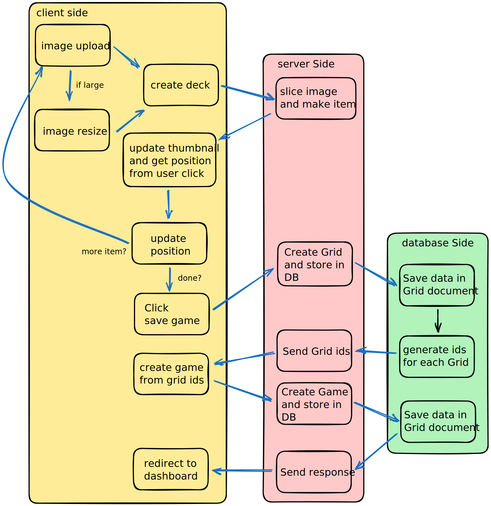
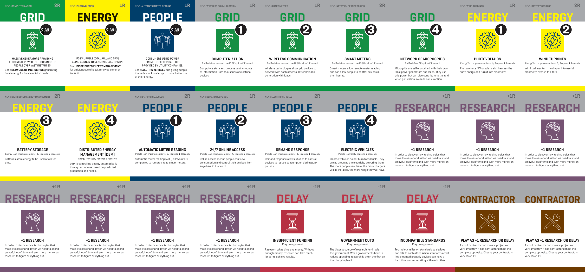
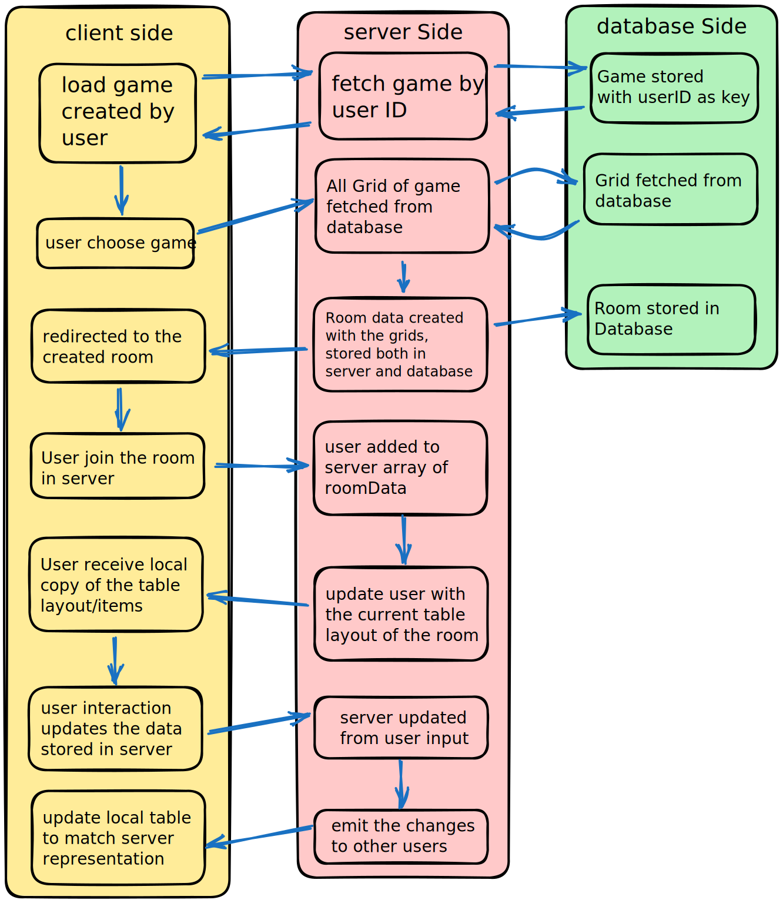

 
<h3><i>Web-based table sandbox for TableTop Games</i></h3>

- [❓ What is SMART SANDBOX (SS) (as of 2023/05/22)](#-what-is-smart-sandbox-ss-as-of-20230522)
- [:book: Frequently Used Terminology](#book-frequently-used-terminology)
    - [:black\_joker: There are currently 3 types of game objects, of which all can be dragged.](#black_joker-there-are-currently-3-types-of-game-objects-of-which-all-can-be-dragged)
    - [:books: A stack of stackable game objects is called a *pile*.](#books-a-stack-of-stackable-game-objects-is-called-a-pile)
    - [:hand: There are currently 3 zones that game objects can exist in while in-play.](#hand-there-are-currently-3-zones-that-game-objects-can-exist-in-while-in-play)
    - [:video\_game: Game](#video_game-game)
    - [:chart\_with\_upwards\_trend: Grid](#chart_with_upwards_trend-grid)
    - [:house: Room](#house-room)
    - [:file\_folder: tableData](#file_folder-tabledata)
- [:memo: Technologies and libraries used](#memo-technologies-and-libraries-used)
- [:game\_die: Central Logics](#game_die-central-logics)
    - [:hammer: Building Games](#hammer-building-games)
    - [:space\_invader: Playing Game](#space_invader-playing-game)
- [:pencil: Extra notes and recommendations (last updated: 2023/05/22):](#pencil-extra-notes-and-recommendations-last-updated-20230522)

# ❓ What is SMART SANDBOX (SS) (as of 2023/05/22)

SS is a platform in which the BCIT SMART team will be using to communicate the deliverables of the team to client in an easy and fun ways.

The host can create games by uploading grids of ***game items*** (e.g. cards, tokens, etc.) and generate a **room** from the *game data* in which others can join and interact with the generated items.

> **_If you are starting to work on SS, please check the :point_right: [setup guide](./docs/setup.md) :point_left:_**

# :book: Frequently Used Terminology
### :black_joker: There are currently 3 types of game objects, of which all can be dragged.
- ***Card:*** A card has two sides, front and back. Each side can use a different image. Card can also be flipped and piled.
> *Not to be confused with the poorly named 'cards' zone.*
- ***Token:*** Similar to card except that tokens from the same deck are all identical.
- ***Piece:*** A piece has one side and a singular image. Pieces cannot be flipped and cannot be piled.

### :books: A stack of stackable game objects is called a *pile*.

Create piles by dragging game objects of the same kind on top of another homogeneously-typed game object or pile. 
Separate the pile by right-clicking and choosing `Disassemble`.
Piles are automatically disassembled when they are moved into a deck or hand.

### :hand: There are currently 3 zones that game objects can exist in while in-play.
- ***Hand:*** Game objects that are currently in a player's hand. These objects are hidden from and inaccessible by other participants while they exist in this zone.
- ***Deck:*** Game objects that have either not been dealt from their original deck or have been since them moved back into. Every **Card** should have a reference to their original deck such that they can be recalled back into it. Game objects that did not start in a deck should never have access to that deck (ie: card from the 'red' deck should never find its way into the 'blue' deck). A **pile** (ie: 'discard' pile) can however mix and match cards from different decks.
- ***Cards***: Game objects that are not in any hand or deck belongs in this zone. Poorly named due to cards being the only game object type back in time. A more accurate name would be *table* or *free*.

### :video_game: Game 
Store information about that game, such as the name and decks that exist within it.
### :chart_with_upwards_trend: Grid 
Store information about a deck of homogeneously-typed game objects (ie: deck of exclusively tokens).
### :house: Room
allows a Game to be hosted and for other players to join.
### :file_folder: tableData
stores information about the room, such as the players participating and the state of the Game.

# :memo: Technologies and libraries used

1. MERN Stack: This game is built with React.js on the front end, Express.js and Node.js on the back end, with MongDB being used as our database option.
2. [Socket.io](https://socket.io/): We use Socket.io for sending and receiving data between the client side and server side.
3. [Konva](https://konvajs.org/docs/): A Canvas JavaScript framework that allows animations, transitions, layering and event handling etc. We use react-konva to handle the layering and the interactions among various game components.
4. [multer](https://www.npmjs.com/package/multer): A module which is primarily used for uploading images and files. It enables users to upload their own images and create customized games.
5. [sharp](https://www.npmjs.com/package/sharp): A module that allows users to convert large images in common formats to smaller images of different dimensions.
6. [Axios](https://www.npmjs.com/package/axios): Axios is used for sending GET and POST requests and receiving response between client and server side.
7. [bcryptjs](https://www.npmjs.com/package/bcryptjs): A JavaScript library for password salting and hashing. It generates a 'salt' (a piece of randomly generated data) and combines it with the original password to perform password hashing for additional security.
8. [Dotenv](https://www.npmjs.com/package/dotenv): A node.js module that loads environment variables from a ".env" file into "process.env".
9. [Heroku](https://www.heroku.com/): A cloud application platform for the deployment of our application.

# :game_die: Central Logics

### :hammer: Building Games

> *overview of the build game process in **/buildgame** page*
1. image is uploaded by the user using the image upload form.
   + if image size too big, the image is resized in client side to reduce server burden.
2. The number of item in grid is specified in the form.
> e.g. in the case of image below
  
  There are **9 cards** across and **3 cards** down, in total **27 cards**.
3. The image and the rest of the formdata is sent to the server to slice image appropriately and create game objects.
4. The generated item is sent back to client and displayed once user click on the location for the item.
5. Once all items are added, click save game.
6. Each items that were added are stored in database as Grid.
7. A Game data is created from the ids of Grid objects and stored in database.
8. Once a game object is successfully created, user is redirected to the dashboard.

### :space_invader: Playing Game

> *overview of the play game process (initialization) in **/room?=id** page*
1. in the host Room page (*/games*), choose a game created by the user.
2. Clicking the game will generate the room data in the server-side, and the room id is sent back to the client side to redirect the user to "/room?=`roomID`"
3. Once redirected, room ID and username is used to add the user to the roomData stored in server.
4. Once added, the server will emit the roomData to client.
5. The data is received by the table of client and items are displayed.
6. User action (drag, drop, flip, etc.) will send data to server to update the roomData.
7. Once updated, server will emit the change to all users.
8. Client will received the update data from server and update the local representation to match the most recent server data.
# :pencil: Extra notes and recommendations (last updated: 2023/05/22):
- The side bar has no function except for log out. discuss with Alan for it's purpose, and if it is deemed unnecessary, do remove.
- The zoom function for cards (e.g. zooming into card when hover) is a necessity, as some [cards](./docs/DECK_SMART.png) have texts in them and is illegible when they are at comfortable playing size (*65px wide 91px high*)
- It is recommended that your code follows the functional paradigm.
- Game Actions such as drag, move, flip, rotate, or whatever may be implemented should exist in the gameaction.jsx module.
- Game objects such as card, token, piece, or whatever may be implemented should exist in the gameRoomComponents directory.
- The heroku server will be slower than most client-side machine, so try to optimize the server performance by implementing *uWebsocket.js* or other server-side module.
- Read module-specific comments for further explanation.